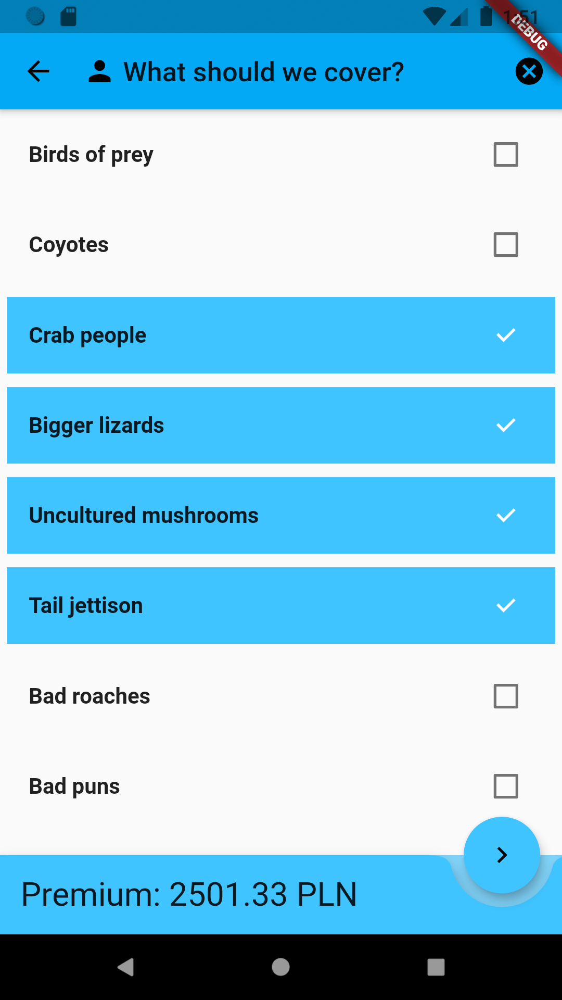

# Flutter PoC: Personal Insurance

A Flutter project example covering concerns commonly encountered in business apps.

<br>


<table><tr>
<td></td>
<td></td>
<td></td>
</tr></table>
<br>

# Blog Post

https://altkomsoftware.pl/blog/flutter-dart-quickly-build-mobile-app-without-losing-much-hair/

<br>

# Dependency

The application attempts to access a running Mockoon Mock API at startup. 

- Mockoon
  - https://mockoon.com/
  - https://github.com/mockoon/mockoon
    
    - e.g. MacOS Install: `brew cask install mockoon`


<table><tr>
<td></td>
</tr></table>
<br>

# Running

- Ensure Mockoon Environment is configured with `mockoon_environment` - (import JSON into Mockoon). 
- Ensure Mockoon is running locally
- Ensure API routes are accessible on `0.0.0.0` i.e. `localhost`, `127.0.0.1`
  - e.g. http://localhost:3000/personalInsuranceFlutter/getDicts
- Ensure the `apiURL` static field in `lib/services/Helper` class is correctly set
  - Localhost setting for `apiURL` for The Android and iOS will differ, see below.
  - The helper will auto-adapt the `apiURL` based on `Platform`.  

<br>

If the local server is not running, application will show an error on startup.

<table><tr>
<td></td>
<td></td>
</tr></table>
<br>

## Android

- `apiURL = "http://10.0.2.2:3000/personalInsuranceFlutter/";`
- Ensure the emulator can access `localhost` via `10.0.2.2` in Dart code.   
  - Special alias to your host loopback interface (i.e., 127.0.0.1 on your development machine) 
  - https://developer.android.com/studio/run/emulator-networking.html
  

<br>

## iOS

- `apiURL = "http://localhost:3000/personalInsuranceFlutter/";`

The iOS Simulator uses the host machine network so you should be able to just use `localhost` or your machines IP address, whichever IP your web service is listening on.

More info on https://stackoverflow.com/questions/6077888/how-do-i-access-the-host-machine-itself-from-the-iphone-simulator

You will need to add the following to the project's `Info.plist`.

```
<key>NSAppTransportSecurity</key>
<dict>
    <key>NSAllowsArbitraryLoads</key>
        <true/>
</dict>  
```

Otherwise this error is going to happen.

```
Cannot start load of Task <xx-xx>.<x> since it does not conform to ATS policy.
```

<br>

# Author

[Wojciech Kuroczycki](mailto:wojciech.kuroczycki@altkomsoftware.pl), Lead Developer

[Altkom Software & Consulting](https://github.com/asc-lab)

<br>

# License

The MIT License (MIT)

